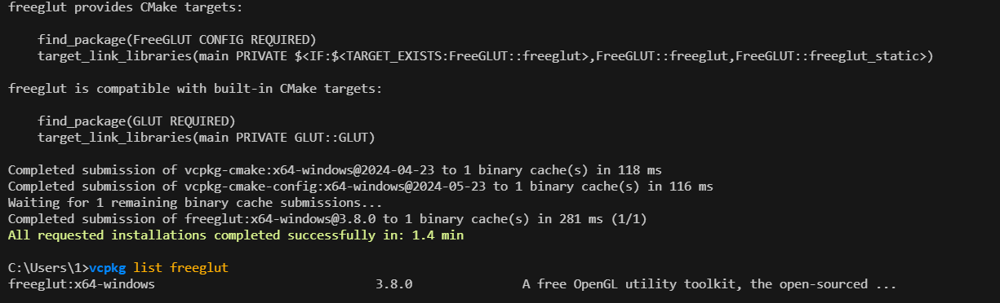
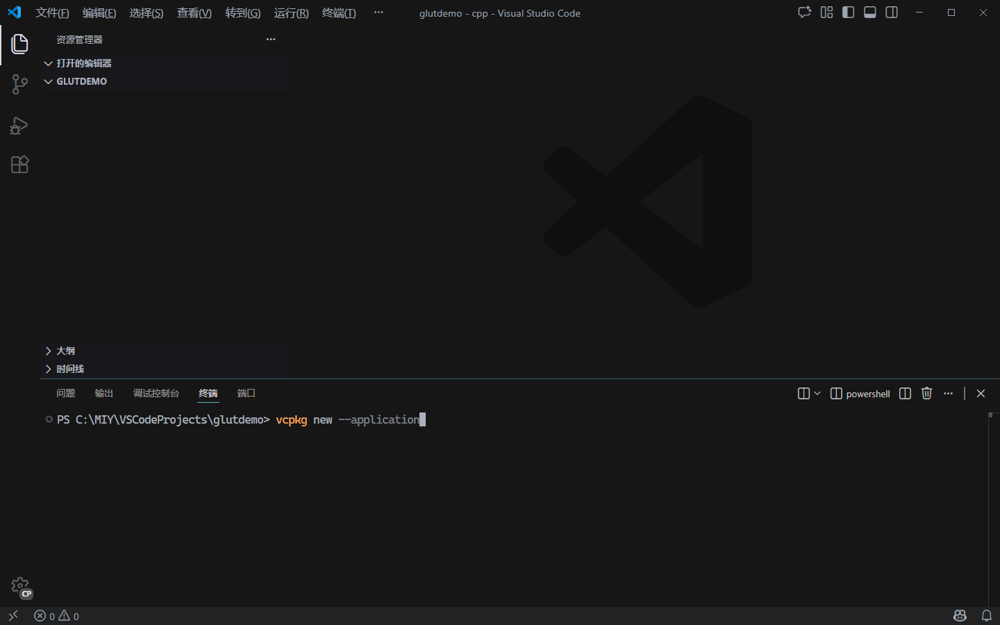
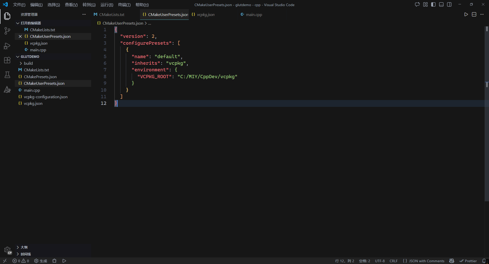
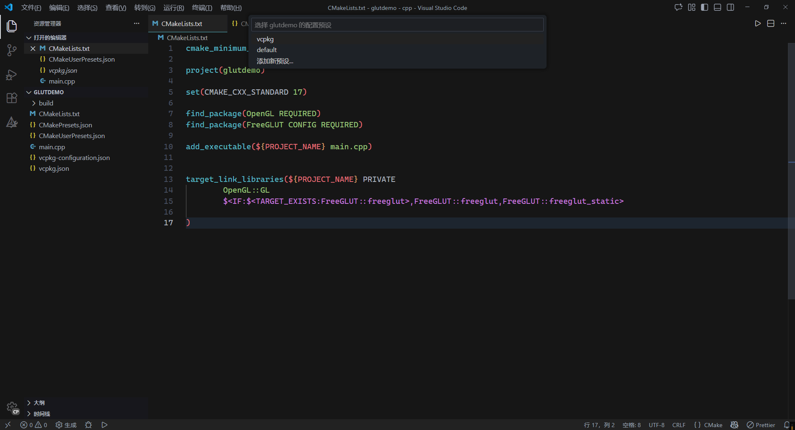
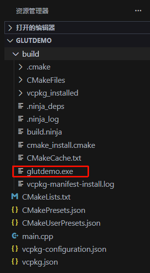
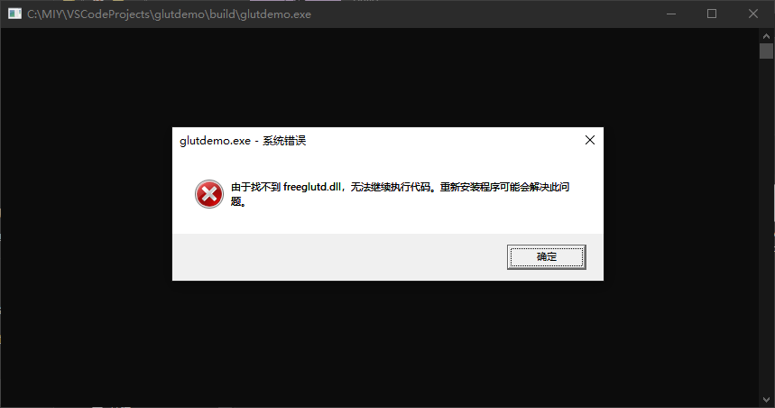
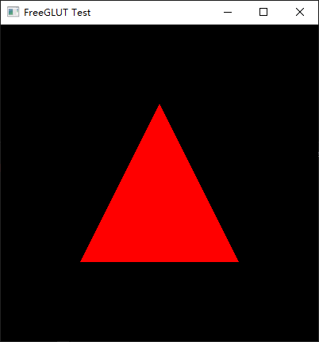

# 在vscode中使用vcpkg+cmake配置freeglut项目

[微软官方文档](https://learn.microsoft.com/en-us/vcpkg/get_started/get-started-vscode?pivots=shell-powershell)

# 1 使用vcpkg安装freeglut

安装`freeglut`

```bash
vcpkg install freeglut
```



在这里可以看到`freeglut`​提供两种`cmake`项目的配置方案

第一种为默认配置

```cmake
find_package(FreeGLUT CONFIG REQUIRED)
target_link_libraries(main PRIVATE $<IF:$<TARGET_EXISTS:FreeGLUT::freeglut>,FreeGLUT::freeglut,FreeGLUT::freeglut_static>)
```

第二种为兼容模式

```cmake
find_package(GLUT REQUIRED)
target_link_libraries(main PRIVATE GLUT::GLUT)
```

# 2 配置方案

## 方案1 使用默认配置

按照文档新建空项目`glutdemo`



在项目根目录执行

```bash
vcpkg new --application
```

根目录下会生成一个清单文件（包含项目中要用到的库，默认为空）`vcpkg.json`​，以及一个包管理器配置文件（配置包的来源，以及版本锁定，方便团队协作）`vcpkg-configuration.json`

通过`vcpkg-configuration.json`​配置后的项目即使在完全更换开发环境后（不同版本的`vcpkg`，不同版的操作系统）也能确保其他人下载这些代码到本地后编译时使用的包和发布者创建项目时用的包版本相同。

项目使用的包完全存放在`glutdemo/build`​下，而不是使用`vcpkg`全局安装的包，能有效避免版本冲突，起到环境隔离的作用。

‍

声明项目用到的`freeglut`依赖

```bash
vcpkg add port freeglut
```

此时`vcpkg.json`会发生变化

```json
{
  "dependencies": [
    "freeglut"
  ]
}
```

创建`CMakeLists.txt`

```cmake
cmake_minimum_required(VERSION 3.10)

project(glutdemo)

set(CMAKE_CXX_STANDARD 17)

find_package(OpenGL REQUIRED)
find_package(FreeGLUT CONFIG REQUIRED)

add_executable(${PROJECT_NAME} main.cpp)


target_link_libraries(${PROJECT_NAME} PRIVATE
        OpenGL::GL
        $<IF:$<TARGET_EXISTS:FreeGLUT::freeglut>,FreeGLUT::freeglut,FreeGLUT::freeglut_static>

)
```

添加源文件`main.cpp`

```cmake
#include <GL/freeglut.h>

// Display callback function
void display() {
    glClear(GL_COLOR_BUFFER_BIT);
    
    // Draw a red triangle
    glBegin(GL_TRIANGLES);
    glColor3f(1.0f, 0.0f, 0.0f);  // Red
    glVertex2f(-0.5f, -0.5f);
    glVertex2f(0.5f, -0.5f);
    glVertex2f(0.0f, 0.5f);
    glEnd();
    
    glutSwapBuffers();
}

// Main function
int main(int argc, char** argv) {
    glutInit(&argc, argv);
    glutInitDisplayMode(GLUT_DOUBLE | GLUT_RGB);
    glutInitWindowSize(400, 400);
    glutCreateWindow("FreeGLUT Test");
    
    // Set background color to black
    glClearColor(0.0f, 0.0f, 0.0f, 1.0f);
    
    glutDisplayFunc(display);
    glutMainLoop();
    
    return 0;
}
```

为了使`cmake`​识别`vcpkg`​还需要创建`CMakePresets.json`​设置`vcpkg`工具链文件

```json
{
  "version": 2,
  "configurePresets": [
    {
      "name": "vcpkg",
      "generator": "Ninja",
      "binaryDir": "${sourceDir}/build",
      "cacheVariables": {
        "CMAKE_TOOLCHAIN_FILE": "$env{VCPKG_ROOT}/scripts/buildsystems/vcpkg.cmake"
      }
    }
  ]
}
```

最后创建`CMakeUserPresets.json`​配置本地`vcpkg`路径，该文件仅供本地使用

```cmake
{
  "version": 2,
  "configurePresets": [
    {
      "name": "default",
      "inherits": "vcpkg",
      "environment": {
        "VCPKG_ROOT": "<path to vcpkg>"
      }
    }
  ]
}
```

​`VCPKG_ROOT`​对应的值为本地`vcpkg`​的路径，需要修改为自己的`vcpkg`路径



重启`vscode`​，选择`default`预设

> 若没有弹窗则参考官方文档按下`shift + ctrl + p`​后选择`cmake: build`



构建完成后会在项目根目录下生成`build`​文件夹以及编译好的`exe`​文件，但是此时直接运行`glutdemo.exe`​会报错，通过将`glutdemo/build/vcpkg_installed/x64-windows/debug/bin`​下的`freeglutd.dll`​复制到`build/`下即可





运行效果如下



## 方案2 使用兼容模式

参考方案1，只需修改`CMakeLists.txt`即可

```cmake
cmake_minimum_required(VERSION 3.10)

project(robert)

set(CMAKE_CXX_STANDARD 17)

find_package(OpenGL REQUIRED)
find_package(FreeGLUT CONFIG REQUIRED)

add_executable(${PROJECT_NAME} main.cpp)


target_link_libraries(${PROJECT_NAME} PRIVATE
        OpenGL::GL
        $<IF:$<TARGET_EXISTS:FreeGLUT::freeglut>,FreeGLUT::freeglut,FreeGLUT::freeglut_static>

)
```

通过这种方式配置的项目会自动将`freeglut.dll`​复制到`build/`下，所以不会出现前面报错的情况

‍

‍
